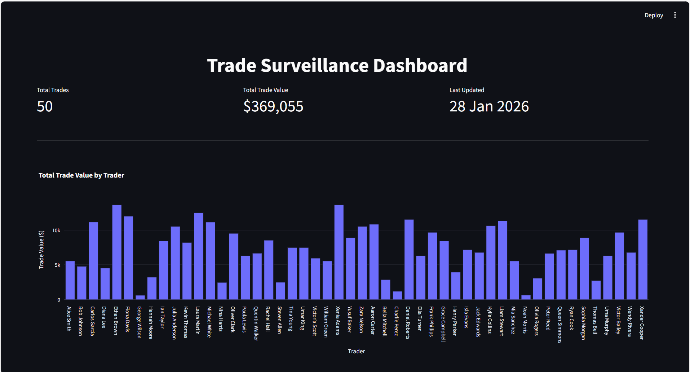
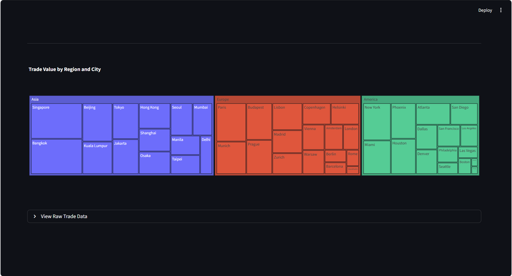

# Trade Surveillance Dashboard 📊

**Mini Project with Self-Made Data**

This is a simple interactive dashboard built using **Streamlit** and **Plotly** to visualize trade data. All data used in this project is **synthetic / self-generated** for demonstration purposes.

---

## Features

- **Top Metrics**
  - Total number of trades
  - Total trade value
  - Last updated timestamp

- **Visualizations**
  - Total trade value by trader
  - Number of trades per day
  - Trade value and quantity by region (dual-axis chart)
  - Trade value by region and city (treemap)

- **Raw Data Viewer**
  - Expandable table to inspect individual trade records

---

## Installation

1. Clone the repository:

```bash
git clone https://github.com/mariaaammm/trade-surveillance-dashboard.git
cd trade-surveillance-dashboard
```

2. Create a virtual environment (optional)

```bash
python -m venv venv
source venv/bin/activate  # Linux / macOS
venv\Scripts\activate     # Windows
```

3. Install dependencies:
```bash
pip install -r requirements.txt
```
## How to Run 📈

Run the Streamlit app locally with:
```bash
streamlit run trades.py
```

## Screenshots

<table>
  <tr>
    <td align="center">
      <br>
      <b>Total Trade Value by Trader</b>
    </td>
    <td align="center">
      <br>
      <b>Trade Value by Region and City</b>
    </td>
  </tr>
</table>
